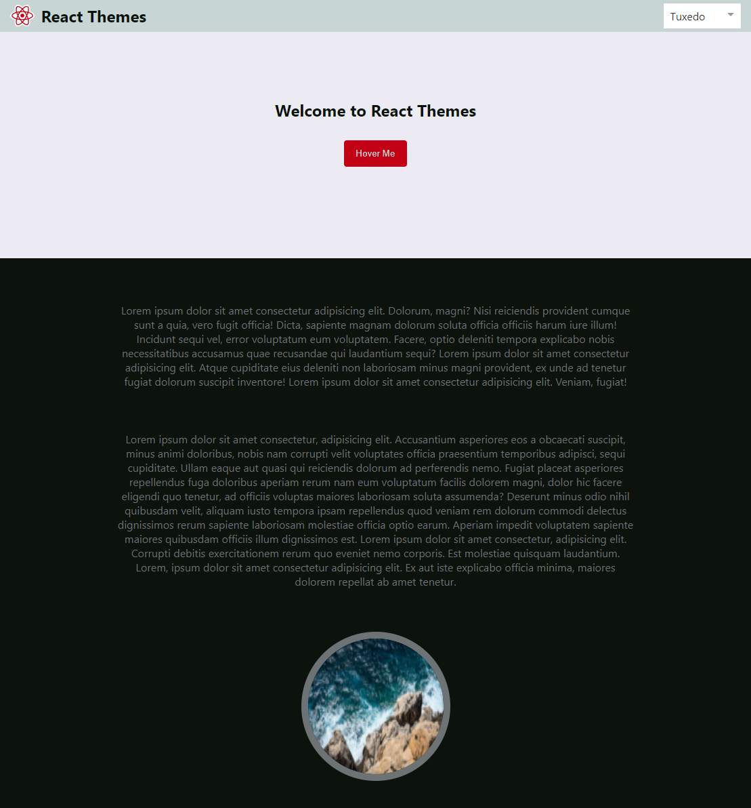

# React Themes

## Available Scripts

In the project directory, you can run:

### `npm install`

Installs all dependencies that are necessary to run the app locally.

### `npm start`

Runs the app locally in development mode.\
Open [http://localhost:3000](http://localhost:3000) to view it in your browser.

The page will reload when you make changes.\
You may also see any lint errors in the console.
